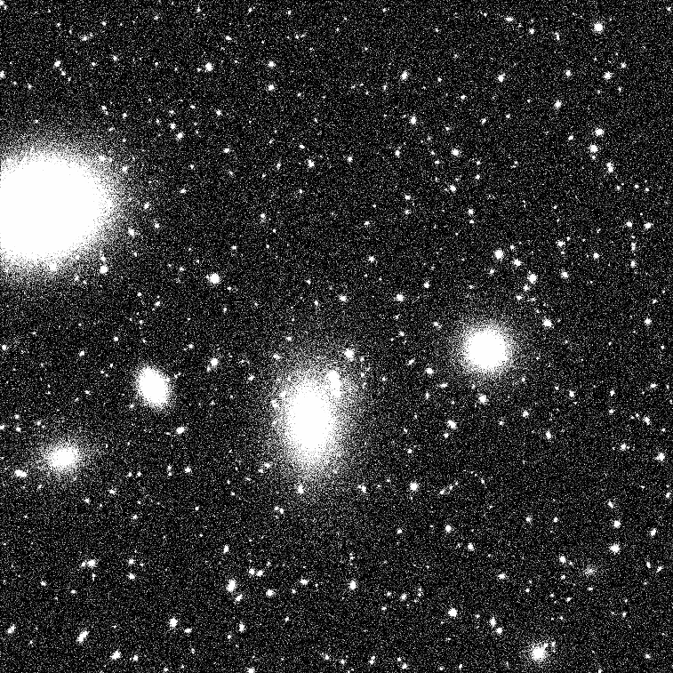
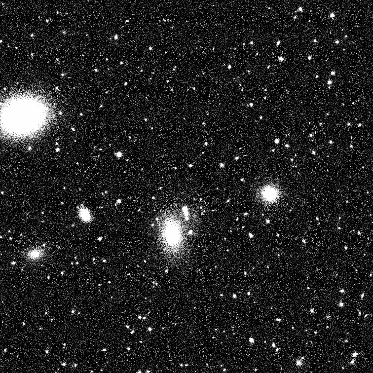
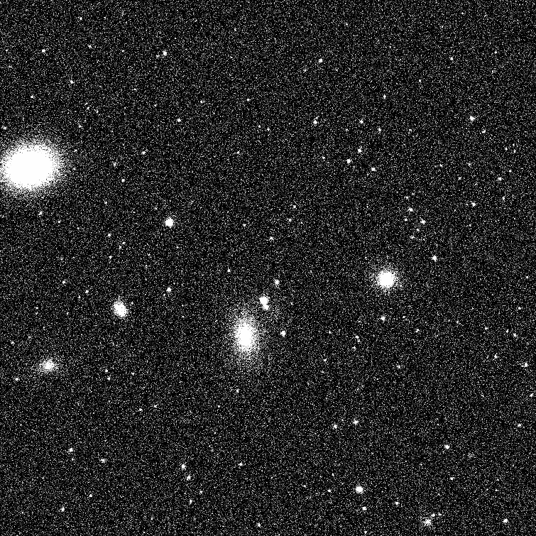
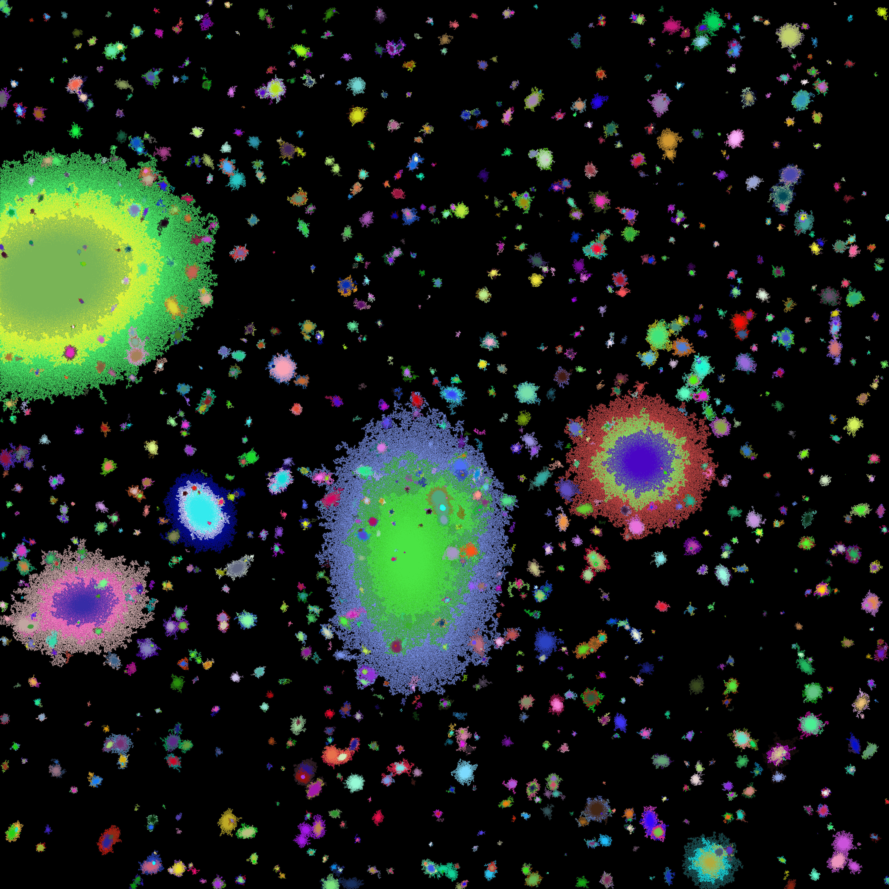
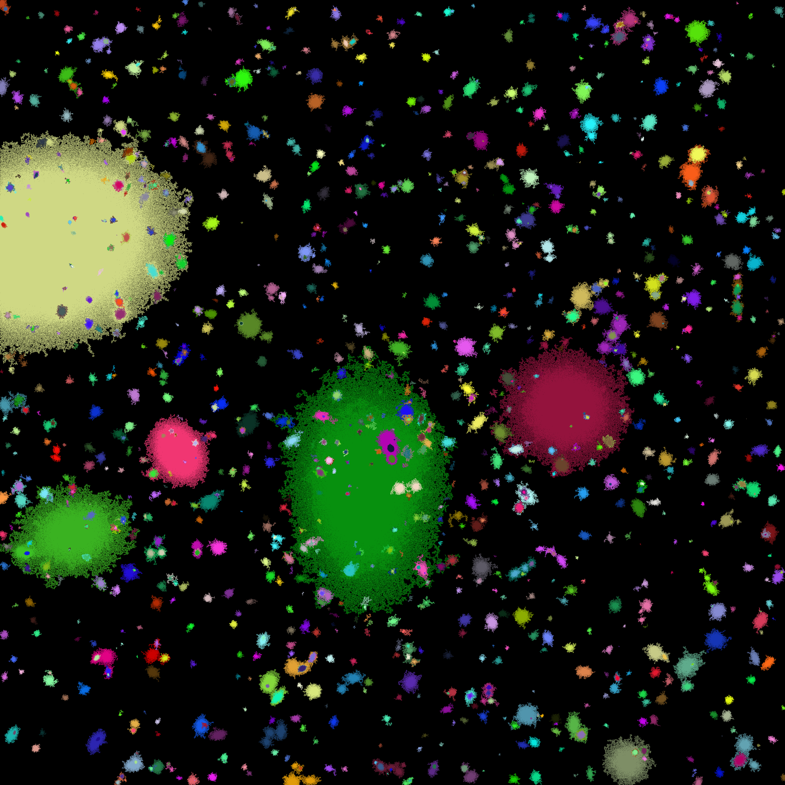

# Multi-Spectral-Sim

A Python-based simulator for generating synthetic multi-band astronomical images to evaluate and validate multi-spectral source segmentation algorithms, particularly the MMTO ([Faezi et al.](#1)).

The simulation mimics actual multi-band observations of a specific section of the sky and includes various sources (stars, galaxies, and background galaxies), each with its own unique parameters, such as surface brightness, flux per unit solid angle of the image, effective radius, and axis ratio. To each frame, different Gaussian and Poissonian noises were added.

    
    
    
    
    
     
    <em>Top row: Three-band astronomical image simulation with different parameters of surface brightness, effective radius, axis ratio, and noise distribution. Each frame has a size of 4,000^2 pixels.</em>
         Bottom row: MMTO multi-band segmentation map output, where the 'co_sim' is set to (left panel) a value greater than one or less than zero, and (right panel) the optimal value (0.94 for this data set). 
        

### Installation

    
    $ cd /path/to/workspace
    $ git clone git@github.com:m-faezi/Multi-Spectral-Sim.git
    $ cd Multi-Spectral-Sim
    $ python -m venv ./venvs/Multi-Spectral-Sim
    $ source ./venvs/Multi-Spectral-Sim/bin/activate
    $ pip install -r requirements.txt

We acknowledge that the simulations will not reproduce all the real data complexities (e.g., different galaxy morphologies,
 artifacts, PSF, satellite tracks, etc.), which might lead to biases in the analysis of the
completeness limits.

This simulator draws inspiration from single-band astronomical simulations used in [Venhola et al.](#2).
## Bibliography

- <a id="1">Faezi M. H., Peletier R., & Wilkinson M. H. (2024). “Multi-Spectral Source-Segmentation Using Semantically-Informed Max-Trees”. In: *IEEE Access* 12, pp. 72288 - 72302. DOI: [10.1109/ACCESS.2024.3403309](https://doi.org/10.1109/ACCESS.2024.3403309).</a>
- <a id="2">Venhola A., Peletier R. F., Salo H., Laurikainen E., Janz J., Haigh C., Wilkinson M. H. F., Iodice E., Hilker M., Mieske S., et al. (2022). "The Fornax Deep Survey with the VST-XII. Low surface brightness dwarf galaxies in the Fornax cluster". In: <em>Astronomy & Astrophysics</em> 662, A43. DOI: <a href="https://doi.org/10.1051/0004-6361/202141756">10.1051/0004-6361/202141756</a>.</a>

##

